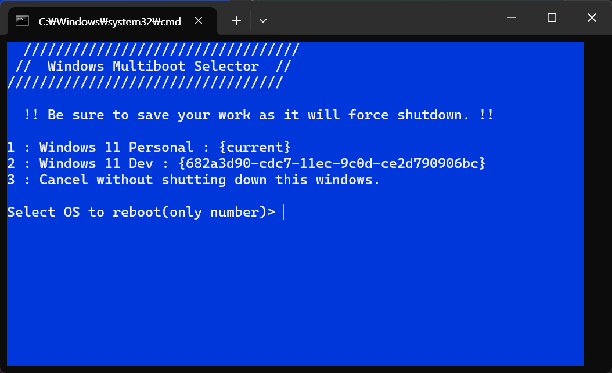
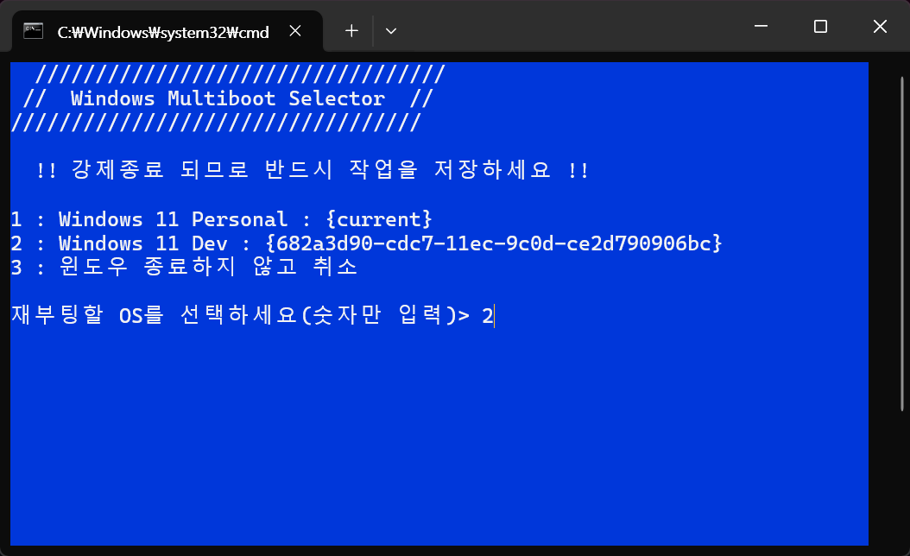

# winMultibootSelector

Windows Multiboot(dualboot) OS Selector  
by Windows Native Batch Script   
Version : 1.0.0

윈도우 멀티부팅 환경에서, 원하는 OS로 바로 재부팅 해주는 스크립트 입니다.  
bat 스크립트이므로, 별도의 설치 없이 실행가능합니다.(관리자 권한 필요)

한국어 스크린샷

## 사용법
1. 소스코드(.bat파일) 다운로드 또는 코드를 복사하여 직접 로컬머신에 생성
2. 관리자 권한으로 실행
3. 부팅하고자 하는 OS 의 **번호**를 입력 후 엔터

## 기타
* 부팅된 OS에서도 winMultibootSelector 가 있어야 유용하니 참고하세요.

# Future Work
* 깃허브로 관리할때, global(english) 버전과 한국어(korean)버전을 어떻게 관리하는지 알아보고 변경할 것.